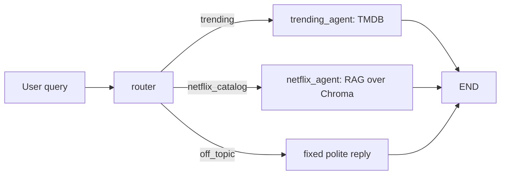

# Report — Agentic Movie Recommendation Chatbot

## A note on process

I had limited time to complete this assessment (~5 hours end to end), so I
optimized for a small, working solution over a more elaborate one: two clearly
separated agents, a router with a sensible fallback, real error handling, and a
mocked test suite — rather than a larger surface area of half-finished features.

I used Claude Code throughout the build, mainly to keep the work organized into
concrete steps and as a hands-on coding assistant for writing and debugging the
implementation. The architectural decisions — the LangGraph design, the routing
strategy (LLM classifier + keyword fallback + context-aware follow-ups), and the
overall technical approach — were mine; I directed those choices rather than
delegating them, and used AI as an accelerant for execution once the direction
was set.

## Approach

The chatbot is a LangGraph `StateGraph` with four nodes: a router and three
terminal agents/responses.

State is `{messages, route}`. `messages` accumulates the full conversation
(both `HumanMessage` and `AIMessage`), so agents and the router have full
context for follow-up turns. The CLI (`src/main.py`) drives the graph with
`graph.stream(state, stream_mode=["messages", "updates"])`, printing only
the tokens whose `langgraph_node` metadata matches an agent node — the
router's raw structured-output call never leaks into the terminal.

A query flows as: user input → router classifies (LLM + keyword fallback)
→ conditional edge to the matching agent → agent generates a response
(grounded in TMDB data or retrieved Netflix documents) → streamed back
token-by-token.

## Design choices

| Decision | Choice | Rationale |
|---|---|---|
| Orchestration | LangGraph `StateGraph`, router node + 2 agent nodes + fixed off-topic node | Explicit, inspectable routing; conditional edges map directly to the assessment's "route by content" requirement |
| File structure | 7 flat `src/` modules (`main`, `graph`, `agent_trending`, `agent_netflix`, `tmdb`, `rag`, `config`) | Given the time budget, avoided nested packages (`agents/`, `tools/`, `rag/`) in favor of a flat structure that's still clearly separated by responsibility |
| UI | Interactive CLI (`rich` for a minimal colored prompt + spinner) | No UI requirement in the spec; CLI is fastest to build and test, and still satisfies "streaming" and "minimal setup" requirements |
| Netflix RAG | Persistent Chroma + `text-embedding-3-small`, lazy ingestion on first run | Zero-infra local vector store; lazy + cached ingestion avoids re-embedding ~6k titles on every run |
| Routing | LLM router with Pydantic structured output + keyword fallback | Robust to occasional LLM/gateway hiccups without adding a second network dependency |
| Multi-turn context | Full uncapped message history passed to router and both agents | Simplest correct implementation for a short conversation; router prompt explicitly says a topic-less follow-up continues the previous route |
| Streaming | Token-by-token for the final agent's answer only, filtered by `langgraph_node` | Keeps the terminal output clean — never shows the router's internal classification call |
| Errors | Per-turn try/except in `main.py`, TMDB retry (tenacity, 3 attempts) + graceful degradation, `logging` to `app.log` (DEBUG) / stderr (WARNING+) | Meets the "hide errors and failures" requirement while keeping the code path short |
| Testing | `pytest` + `pytest-mock`, 10 tests, all mocked | No API keys needed to run the suite; keeps tests fast and deterministic |
| Packaging | `pip` + `requirements.txt` + `.env.example` | Simplest reproducible setup for a take-home; no need for Docker/poetry given the scope |

## Assumptions

- Models: `gpt-4o-mini` for the router and both agents (fast/cheap, sufficient for
  this scope); `text-embedding-3-small` for embeddings.
- `data/titles.csv` (Kaggle Netflix dataset) is committed to the repo — it's small
  and public, so the evaluator doesn't need a Kaggle account.
- Out-of-domain queries (e.g. "what's the weather?") get a fixed polite decline via
  a third `off_topic` router class, rather than being forced into one of the two
  agents.
- Submission is via a public GitHub repo rather than a zip.

## Challenges & results

1. **Chroma's batch size cap on bulk ingestion.** Embedding and inserting all
   ~6,000 Netflix titles in a single `add_documents()` call exceeded Chroma's
   internal max batch size (a hard cap independent of dataset size). Fixed by
   chunking ingestion into batches of 1,000 documents.
2. **Router losing conversation context on short follow-ups.** Classifying only
   the latest message meant a follow-up like "something similar but funnier" had
   no topical signal and fell through to `off_topic`. Fixed by passing the full
   message history to the router and explicitly telling it (via the previous
   turn's route, injected into the system prompt) that topic-less follow-ups
   continue the prior route rather than defaulting to off-topic.
3. **Mocking pydantic-based LangChain objects in tests.** `mock.patch.object` on
   a live `ChatOpenAI`/`Runnable` instance failed at teardown because pydantic
   models restrict `__setattr__`/`__delattr__` for attributes outside their
   declared fields. Solved by wrapping each `.invoke()` call in a small plain
   Python function (`_classify_route`, `_generate_reply`) that tests can patch
   directly.

## Next steps / productization

- **Persistent conversational memory** across CLI sessions (currently in-memory only,
  lost on restart) — e.g. a lightweight SQLite/Redis-backed LangGraph checkpointer.
- **Evaluation**: LLM-as-judge scoring of recommendation relevance and groundedness
  (no hallucinated titles), tracked over time with an eval framework (e.g. MLflow or
  Langfuse) for regression detection across prompt/model changes.
- **REST API + minimal web UI.** The CLI was the right call for this exercise —
  fastest to build and to verify streaming/routing/error-hiding end to end within
  the time available — but it doesn't scale to real users. A production version
  would expose the same `graph.stream()` call behind a FastAPI endpoint using
  Server-Sent Events (or WebSockets) to keep token-by-token streaming over HTTP,
  with a thin React (or HTMX, for less frontend overhead) chat UI on top — message
  bubbles, a typing indicator during routing/retrieval, and the same
  graceful-degradation messages surfaced in the UI instead of the terminal.
  Conversation state would move from an in-process Python list to the persistent
  memory layer mentioned above, keyed by session ID, so concurrent users don't
  share state.
- **Containerization** (Docker) for consistent deployment across environments.
- **TMDB response caching** (e.g. short TTL cache) to reduce redundant calls and
  improve resilience to rate limits.
- **Observability**: distributed tracing (e.g. OpenTelemetry/Langfuse) across the
  router → agent → external API/vector-store call chain, for latency and failure
  diagnosis in production.
- **Guardrails**: stricter validation that agent responses only cite
  actually-retrieved/fetched titles (currently enforced only via prompt
  instruction, not verified programmatically).
- **CI/CD**: GitHub Actions running `pytest` and lint checks on every push/PR.
